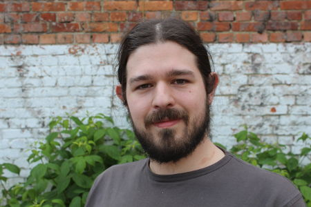
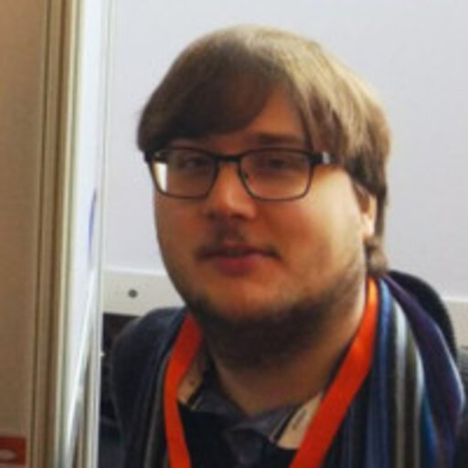

<h1 align="center">
logAMS 2023
</h1>

<h1 align="center">
Go to <a href="https://logams.github.io/">logAMS 2024</a>
</h1>

    

Welcome to the website for <strong>logAMS</strong>, the Amsterdam meetup for the global <a href="https://logconference.org">LoG Conference</a>. Hosted by Elsevier & Vrije Universiteit Amsterdam on November 29 + 30, 2023.

  <a href="#about">About</a> •
  <a href="#dates">Dates</a> •
  <a href="#registration">Registration</a> •
  <a href="#contact">Contact</a> •
  <a href="#organisation">Organisation</a>

## About

The logAMS conference is a satellite event of the global LoG Conference, featuring talks, posters and networking opportunities, aiming to bring together the local community in graph machine learning and geometry.

### Details

* Meet-up on November 29 + 30, 2023.
* The event is **free** ✨ to attend.
* Hosted by Elsevier at Radarweg 29a, 1043 NX Amsterdam. 
* Coffee and lunch provided.

<!--

## Agenda

By attending logAMS, you will have the opportunity to:
* Learn from leading experts in the field through keynote talks and research presentations. 
* Network with fellow researchers, professionals, and enthusiasts in the community. 
* Share your own research and insights during poster sessions and interactive discussions. 
* Stay up-to-date with the latest trends and advancements in machine learning on graphs and geometry.
-->

## Dates

* October 10, 2023. Registration opens.
* November 13, 2023. Registration closes. After this date we maintain a wait list and registrations are considered up to capacity. 
* November 29 + 30, 2023. Conference.

## Schedule

### 29 November

|`Time` |      `Event `     |  `Details` |
|:----------:|:-------------:|:------|
| 09:30 - 10:00 | Registration and coffee | |
| 10:00 - 10:15 | Welcome |                 |  |
| 10:15 - 10:45 | Talk: Miltos Kofinas | Neural Networks are Graphs! GNNs for equivariant processing of NNs  |
| 10:45 - 11:15 | Talk: Taraneh Younesian  | GRAPES: Learning to sample graphs for scalable GNNs |
| 11:15 - 11:30 | Break | |
| 11:30 - 12:00 | Talk: Andrea Cavallo   | GNNs on heterophilous graphs |
| 12:00 - 13:00 | Lunch | |
| 13:00 - 15:00 | Poster Session |  Graph neural networks for metamodelling urban drainage systems (Alexander Garzón)   Physics-Based Graph Neural Networks for Rapid Spatio-Temporal Flood Modelling (Roberto Bentivoglio)   Anomaly Detection in Continuous-Time Temporal Provenance Graphs (Jakub Reha)  Graph Isomorphic Networks for Reliability Assessments in the MV Energy Grid (Charlotte Cambier van Nooten)   Heterophily-Based Graph Neural Network for Imbalanced Classification (Yuntao Li)   No time to waste: practical statistical contact tracing with few low-bit messages (Rob Romijnders)   The Role of Personal Perspectives in Open-Domain Dialogue (Selene Baez Santamaria and Lea Krause)   Adapting Neural Link Predictors for Data-Efficient Complex Query Answering (Daniel Daza)    Graph representation learning identifies repositionable drug candidates for HIV-1 (Andrew Foster) |
| 15:00 - 15:30 | Talk: Dulhan Jayalath and Jonas Jürß | Recursive Algorithmic Reasoning |
| 15:30 - 16:00 | Talk: Floris Geerts | Weisfeiler Leman meet Vapnik Chervonenkis |
| 16:00 - 16:15 | Break | |
| 16:15 - 16:45 | Talk: Hinrikus Wolf and Luca Oeljeklaus | Structural Node Embeddings w. Homomorphism Counts |
| 16:45 - 17:15 | Talk: Tianqi Zhao | Multi-label Node Classification On Graph-Structured Data |
| 17:15 - ~18:30 |    Drinks   |    |
| ~18:30 -  | dinner |   |

### 30 November

|`     Time     ` |      `Event `     |  `Details` |
|:----------:|:-------------:|:------|
| 09:30 - 10:00 | Registration and coffee | |
| 10:00 - 10:15 | Welcome |                 |  |
| 10:15 - 10:45 | Talk: Matthew Stephenson  |  |
| 10:45 - 11:15 | Talk: Rob Romijnders  | No Time To Waste: practical statistical contact tracing with few low-bit messages |
| 11:15 - 11:30 | Break | |
| 11:30 - 12:00 | Talk: Megha Khosla   | Private Graph Reconstruction via Feature Explanations |
| 12:00 - 13:00 | Lunch |  |
| 13:00 - 15:00 | Poster Session | Deep Statistical Solver for Distribution System State Estimation (Benjamin Habib)  Structural Node Embeddings with Homomorphism Counts (Hinrikus Wolf, Luca Oeljeklaus)  Elemental Representations in Graph Neural Networks (Victor Kyllesbech)   Neural Networks Are Graphs! Graph Neural Networks for Equivariant Processing of Neural Networks (Miltiadis (Miltos) Kofinas)   Graph Neural Networks on heterophilous graphs: performance analysis and new architectures (Andrea Cavallo)   Multi-label Node Classification On Graph-Structured Data (Tianqi Zhao)   Hodge-aware learning on simplicial complexes (Maosheng Yang)   Recursive Algorithmic Reasoning (Dulhan Jayalath and Jonas Jürß) |
| 15:00 - 15:30 | Talk: Elvin Isufi |  Graph Neural Networks over Random Graphs |
| 15:30 - 16:00 | Talk: Andrew Foster |  Graph representation learning identifies repositionable drug candidates for HIV-1
| 16:00 - 17:00 |    Drinks   |    |
| 17:00 - 18:00 | Keynote LoG | Kyle Cranmer  |

## Registration
Are you interested in attending logAMS? Please register with this [form](https://forms.gle/U6vNbG6SwYQ362278).

## Contact

For any inquiries or questions about logAMS, please feel free to get in touch with our organising team.

## Organisation ##
* Michael Cochez 
* Thom Pijnenburg
* Dimitrios Alivanistos
* Daniel Daza
* Shujian Yu
* Xander Wilcke
* Taewoon Kim
* Ruud van Bakel
* Yannick Brunink

    

We are part of a global network of local meetups

- 🇺🇸 Stanford, USA.
- 🇩🇪 Munich, Germany.
- [🇳🇱 Amsterdam, Netherlands](http://logams.github.io).
- 🇨🇳 Shanghai, China.
- 🇨🇭 Lausanne, Switzerland.
- 🇫🇷 Paris, France.
- 🇳🇴 Tromso, Norway.
- 🇺🇸 Michigan, USA.
- 🇪🇸 Madrid, Spain.
- 🇨🇳 Beijing, China.
- 🇮🇹 Trento, Italy.
- 🇺🇸 New York, US.
- 🇬🇧 London, UK.
