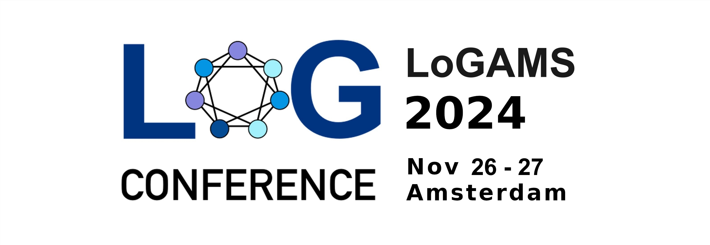

    

Welcome to the website for <strong>logAMS</strong>, the Amsterdam meetup for the global <a href="https://logconference.org">LoG Conference</a>. Hosted by Elsevier & Vrije Universiteit Amsterdam on November 25 + 26, 2024.

  <a href="#about">About</a> •
  <a href="#dates">Dates</a> •
  <a href="#registration">Registration</a> •
  <a href="#contact">Contact</a> •
  <a href="#organisation">Organisation</a>

## About

The logAMS conference is a satellite event of the global LoG Conference, featuring talks, posters and networking opportunities, aiming to bring together the local community in graph machine learning and geometry.

### Details

* Meet-up on November 25 + 26, 2024.
* The event is **free** ✨ to attend.
* Hosted by Elsevier at Radarweg 29a, 1043 NX Amsterdam. 
* Coffee and lunch provided.

## Agenda

By attending logAMS, you will have the opportunity to:
* Learn from leading experts in the field through keynote talks and research presentations. 
* Network with fellow researchers, professionals, and enthusiasts in the community. 
* Share your own research and insights during poster sessions and interactive discussions. 
* Stay up-to-date with the latest trends and advancements in machine learning on graphs and geometry.

## Dates

* October 22, 2024. Registration opens.
* November 14, 2024. Registration closes. After this date we maintain a wait list and registrations are considered up to capacity. 
* November 25 + 26, 2024. Conference.

## Schedule

### Monday November 25

|`Time` |      `Event `     |  `Details` |
|:----------:|:-------------:|:------|
| 09:30 - 10:00 | Registration, coffee & welcome | |
| 10:00 - 10:30 | Talk: Gaurav Rattan | Learning on Graphs with Weisfeiler-Leman  |
| 10:30 - 11:00 | Talk: Liudmila Prokhorenkova  |  Challenges of Generating Structurally Diverse Graphs |
| 11:00 - 11:20 | Break | |
| 11:20 - 11:50 | Talk: Klim Zaporojets   | CYCLE: Cross-Year Contrastive Learning in Entity-Linking |
| 11:50 - 12:20 | Talk: Andrea Cavallo    | Spatiotemporal covariance neural networks |
| 12:20 - 13:20 | Lunch | |
| 13:20 - 15:00 | Poster Session |  From MLP to NeoMLP: Leveraging Self-Attention for Neural Fields (Miltos Kofinas)   HyperSteiner: Computing Heuristic Hyperbolic Steiner Minimal Trees (Alejandro Garcia Castellanos)    IID Relaxation by Logical Expressivity: A Research Agenda for Fitting Logics to Neurosymbolic Requirements (Maarten Stol)   Uncertainty Quantification for GNNs(Charlotte Cambier van Nooten)   Explaining Graph Neural Networks for Node Similarity on Graphs (Daniel Daza)   Predicting Protein Dynamics of Cryptochrome using Generative Models (Dionessa Biton)   Learning Graph Neural Networks using Exact Compression (Jeroen Bollen)   Explainable Graph Neural Networks Under Fire (Zhong Li)   Quantum Computing for Power Flow Analysis (Zeynab Kaseb)   Enabling Large-Scale Coordination of Electric Vehicles Using Reinforcement Learning (Stavros Orfanoudakis)   Guiding diffusion models for antibody sequence and structure co-design with developability properties (Amelia Villegas-Morcillo)    Joint Embedding Predictive Architecture for Self-supervised Pretraining on Polymer Molecular Graphs (Francesco Piccoli)   PowerNet: Truncated Matrix Power Series as Quasi-Equivariant Layers (Alex Gabel) |
| 15:00 - 15:30 | Talk: Maarten Stol  | IID Relaxation by Logical Expressivity: A Research Agenda for Fitting Logics to Neurosymbolic Requirements |
| 15:30 - 16:00 | Talk: Alex Gabel  | PowerNet: Truncated Matrix Power Series as Quasi-Equivariant Layers |
| 16:00 - 16:20 | Break | |
| 16:20 - 16:50 | Talk: Maosheng Yang  | Topological Schrödinger Bridge Matching |
| 16:50 - 17:20 | Talk: Miltos Kofinas  | From MLP to NeoMLP: Leveraging Self-Attention for Neural Fields |
| 17:20 - ~18:30 |    Drinks   |    |

### Tuesday November 26

|`Time` |      `Event `     |  `Details` |
|:----------:|:-------------:|:------|
| 09:30 - 10:00 | Registration, coffee & welcome | |
| 10:00 - 10:30 | Invited Talk: Kubilay Atasu | Graph Machine Learning for Financial Crime Analysis  |
| 10:30 - 11:00 | Invited Talk: Ralvi Isufaj  | Connecting the dots: Practical insights and considerations for building graph based recommender systems at scale  |
| 11:00 - 11:20 | Break | |
| 11:20 - 11:50 | Invited Talk: Deepak Patankar   | Graphs at Booking.com |
| 11:50 - 12:20 | Talk: Tianqi Zhao    | AGALE: A Graph-Aware Continual Learning Evaluation Framework  |
| 12:20 - 13:20 | Lunch | |
| 13:20 - 15:00 | Poster Session |  Topological Schrödinger Bridge Matching (Maosheng Yang)   Bicycle Travel Time Estimation with Graph Neural Networks (Ting Gao)   DNA: Differentially private Neural Augmentation for contact tracing (Rob Romijnders)   AGALE: A Graph-Aware Continual Learning Evaluation Framework (Tianqi Zhao)   Blind identification of overlapping communities from nodal observations ( Ruben Wijnands)   Dataset condensation with latent quantile matching (Wei Wei)   CYCLE: Cross-Year Contrastive Learning in Entity-Linking (Pengyu Zhang)   Hodge-Aware Matched Subspace Detectors (Chengen Liu)   xAI-Drop: Don’t Use What You Cannot Explain (Vincenzo Marco De Luca)   Inverse Design of Copolymers Including Stoichiometry and Chain Architecture (Gabriel Vogel)   Applications of TopoX to Topological Deep Learning (Martin Carrasco)   Graph Neural Networks for Heart Failure Prediction on an EHR-Based Patient Similarity Graph (Heloisa Oss Boll)   Multi-type entity resolution (Alex Ridden) |
| 15:00 - 15:30 | Talk: Rob Romijnders  | DNA: Differentially private Neural Augmentation for contact tracing |
| 15:30 - 16:00 | Talk: Vincenzo Marco De Luca  | xAI-Drop: Don’t Use What You Cannot Explain |
| 16:00 - 16:20 | Break | |
| 16:20 - 16:50 | Talk: Hosein Azarbonyad  | Using Knowledge Graphs for QA Extraction from Scientific Articles |
| 16:50 - 17:20 | Talk: Ana Victória Ladeira  | From Mission Description to Knowledge Graph: Applying Transformer-based models to map knowledge from publicly available satellite datasets. |
| 17:20 - ~18:30 |    Close & Networking   |    |

## Registration
Are you interested in attending logAMS? Please register with this [form](https://forms.gle/ayMm93tGrwsKdqZZ8).

## Contact

For any inquiries or questions about logAMS, please feel free to get in touch with our organising team.

## Organisation ##
* Michael Cochez, Vrije Universiteit Amsterdam
* Thom Pijnenburg, Elsevier
* Taraneh Younesian, Vrije Universiteit Amsterdam
* Romy Vos, Vrije Universiteit Amsterdam
* Elvin Isufi, Delft University of Technology
* Megha Khosla, Delft University of Technology
* Fabian Hoppe, Vrije Universiteit Amsterdam

    

We are part of a [global network of local meetups](https://logconference.org/#accepted-local-meetups-for-log-2024).
