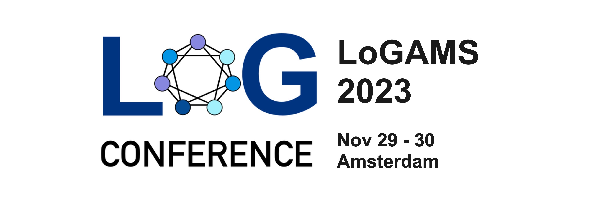
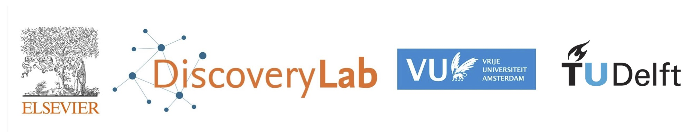

<h1 align="center">
logAMS 2023
</h1>

    

Welcome to the official landing page for <strong>logAMS</strong>, the Amsterdam meetup for the global <a href="https://logconference.org">LOG Conference</a>. Hosted by Elsevier & VU University on November 29 + 30, 2023.

  <a href="#about">About</a> •
  <a href="#dates">Dates</a> •
  <a href="#registration">Registration</a> •
  <a href="#contact">Contact</a> •
  <a href="#organization">Organization</a>

## About

The logAMS conference is a satellite event of the global LOG Conference, featuring a diverse range of presentations, workshops, and networking opportunities. We aim to create a friendly and inclusive environment for participants to engage with the latest research and innovations in machine learning on graphs and geometry.

### Details

* Meet-up on November 29 + 30, 2023.
* The event is **free** :sparkles: to attend.
* Hosted by Elsevier on Radarweg 29a, 1043 NX Amsterdam. 
* Coffee and lunch provided.

<!--

## Agenda

By attending logAMS, you will have the opportunity to:
* Learn from leading experts in the field through keynote talks and research presentations. 
* Network with fellow researchers, professionals, and enthusiasts in the community. 
* Share your own research and insights during poster sessions and interactive discussions. 
* Stay up-to-date with the latest trends and advancements in machine learning on graphs and geometry.
-->

## Dates

* October 10, 2023. Registration opens
* November 10, 2023. Registration closes
* November 29 + 30, 2023. Conference

## Registration
Are you interested in attending logAMS? Please register with this [form](https://docs.google.com/forms/d/e/1FAIpQLSdiVfSgzksCufn3NyZKo2kf8Ypq5e8vIRjcKY6pcjtgXGB9xw/viewform).

## Contact

For any inquiries or questions about logAMS, please feel free to get in touch with our organizing team.

We look forward to seeing you at logAMS and contributing to the thriving machine learning on graphs and geometry community!

## Organization ##
* Michael Cochez 
* Thom Pijnenburg
* Shujian Yu
* Xander Wilcke

    

We are part of a global network of local meetups

- :us: Stanford, USA.
- :de: Munich, Germany.
- [:netherlands: Amsterdam, Netherlands](logams.github.io).
- :cn: Shanghai, China.
- :switzerland: Lausanne, Switzerland.
- :fr: Paris, France.
- :norway: Tromso, Norway.
- :us: Michigan, USA.
- :es: Madrid, Spain.
- :cn: Beijing, China.
- :it: Trento, Italy.
- :us: New York, US.
- :gb: London, UK.
